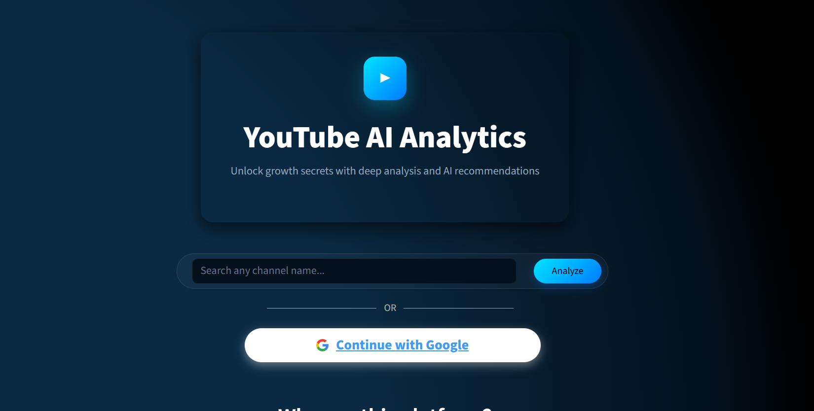
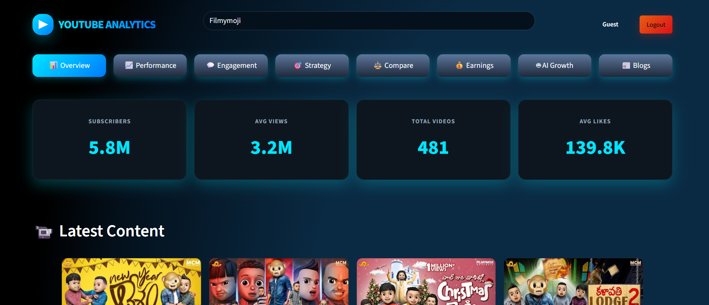
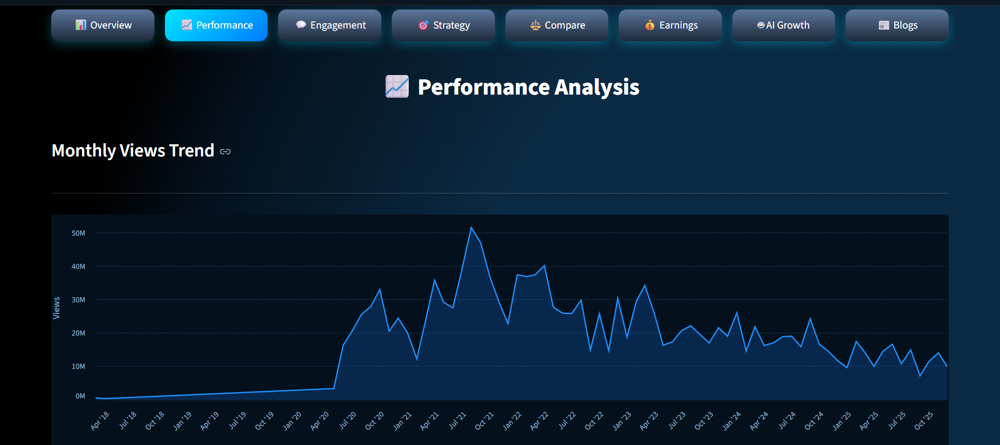
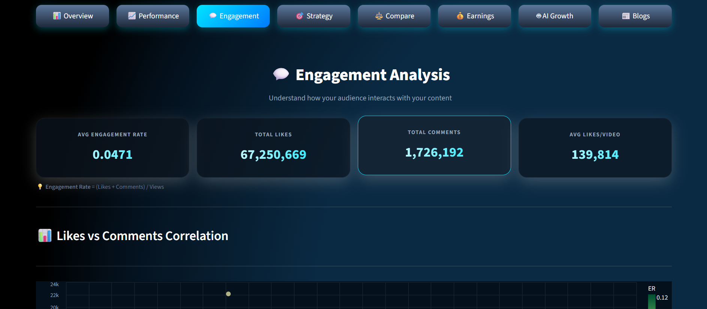
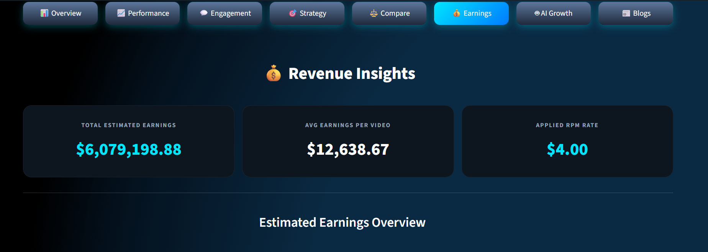
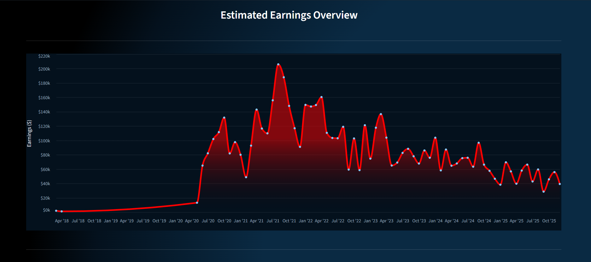
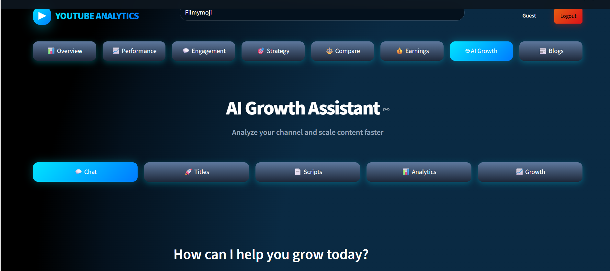

# 🎥 YouTube AI Analytics Platform

An AI-powered YouTube Analytics and Insight Platform built using Python, Streamlit, SQL, and YouTube Data API to analyze channel performance, engagement trends, revenue insights, and AI-driven growth strategies.

The platform transforms raw YouTube channel data into interactive visual dashboards and actionable insights for creators, marketers, and media analysts.

---

# 🚀 Features

## 📊 Channel Overview
- Subscriber analytics
- Average views and likes
- Total uploaded videos
- Latest content tracking
- Channel performance summary

## 📈 Performance Analytics
- Monthly views trend analysis
- Upload frequency tracking
- Average views per video
- Historical performance insights

## 💬 Engagement Analysis
- Likes vs comments correlation
- Engagement rate calculation
- Engagement distribution analysis
- Monthly engagement trends
- Top-performing videos

## 💰 Revenue Insights
- Estimated earnings analysis
- RPM-based revenue estimation
- Yearly earnings distribution
- Revenue trend analysis

## 🤖 AI Growth Assistant
- AI-powered viral title generation
- Content idea suggestions
- Growth recommendations
- Script assistance
- Analytics-based optimization

## 🔐 Authentication
- Google OAuth 2.0 integration
- Secure personalized analytics access
- Guest mode support

---

# 🛠️ Tech Stack

| Technology | Purpose |
|------------|----------|
| Python | Backend & data processing |
| Streamlit | Interactive dashboard |
| YouTube Data API | Analytics data extraction |
| SQL (MySQL / SQLite) | Database management |
| Pandas & NumPy | Data analysis |
| Matplotlib & Altair | Data visualization |
| Google OAuth 2.0 | Authentication |
| AI APIs | AI-powered assistance |

---

# 📌 Project Highlights

- Built a complete end-to-end analytics platform
- Integrated YouTube Data API for real-time analytics
- Implemented AI-powered creator assistance tools
- Designed scalable SQL-based architecture
- Added interactive charts and dashboards
- Developed secure authentication system

---

# 📷 Screenshots

## 🔹 Landing Page


## 🔹 Dashboard Overview


## 🔹 Performance Analytics


## 🔹 Engagement Analysis


## 🔹 Revenue Insights



## 🔹 AI Growth Assistant


---

# 📂 Project Structure

```bash
Youtube-AI-Analytics/
│
├── app.py
├── requirements.txt
├── README.md
├── .env
│
├── images/
│   ├── landing_1.png
│   ├── overview_1.png
│   ├── performance_1.png
│   ├── eng_1.png
│   ├── earn1.png
│   └── ai1.png
│
├── database/
│   ├── db.py
│   └── schema.sql
│
├── analytics/
│   ├── performance.py
│   ├── engagement.py
│   ├── revenue.py
│   └── overview.py
│
├── ai_modules/
│   ├── title_generator.py
│   ├── growth_advisor.py
│   └── script_generator.py
│
├── auth/
│   └── oauth.py
│
├── utils/
│   ├── helpers.py
│   ├── api_handler.py
│   └── data_cleaning.py
│
└── assets/
```

---

# ⚙️ Installation & Setup

## 1️⃣ Clone Repository

```bash
git clone https://github.com/your-username/Youtube-AI-Analytics.git
```

---

## 2️⃣ Move Into Project Folder

```bash
cd Youtube-AI-Analytics
```

---

## 3️⃣ Create Virtual Environment

### Windows

```bash
python -m venv venv
```

### Activate Virtual Environment

```bash
venv\Scripts\activate
```

---

## 4️⃣ Install Dependencies

```bash
pip install -r requirements.txt
```

---

# 📦 Required Libraries

Add these inside `requirements.txt`

```txt
streamlit
pandas
numpy
matplotlib
altair
google-api-python-client
google-auth
google-auth-oauthlib
python-dotenv
sqlalchemy
mysql-connector-python
openai
```

---

# 🔑 Environment Variables

Create a `.env` file in the root folder.

```env
YOUTUBE_API_KEY=your_api_key
GOOGLE_CLIENT_ID=your_client_id
GOOGLE_CLIENT_SECRET=your_client_secret
OPENAI_API_KEY=your_ai_api_key
```

---

# ▶️ Run The Project

```bash
streamlit run app.py
```

---

# 🌐 Application Modules

- Channel Overview
- Performance Analysis
- Engagement Insights
- Revenue Analytics
- AI Growth Assistant
- Google Authentication

---

# 🧠 Skills Demonstrated

- API Integration
- Data Analytics
- Dashboard Development
- SQL Database Management
- Authentication Systems
- AI Integration
- Data Visualization
- Backend Development

---

# 📚 Internship Project

This project was developed as part of the Infosys Springboard Virtual Internship 6.0 focused on building real-world data-driven applications and analytics platforms.

---

# 🔮 Future Enhancements

- Machine Learning Prediction Models
- Comment Sentiment Analysis
- Multi-channel Comparison
- Real-time Live Analytics
- Export Reports as PDF/Excel
- Advanced Recommendation Engine

---

# 👨‍💻 Author

## Pragada Renukesh Durgaprasad

B.Tech Computer Science Engineering Student  
Passionate about AI, Analytics, and Full Stack Development

---

# ⭐ Support

If you found this project useful, give it a ⭐ on GitHub.
